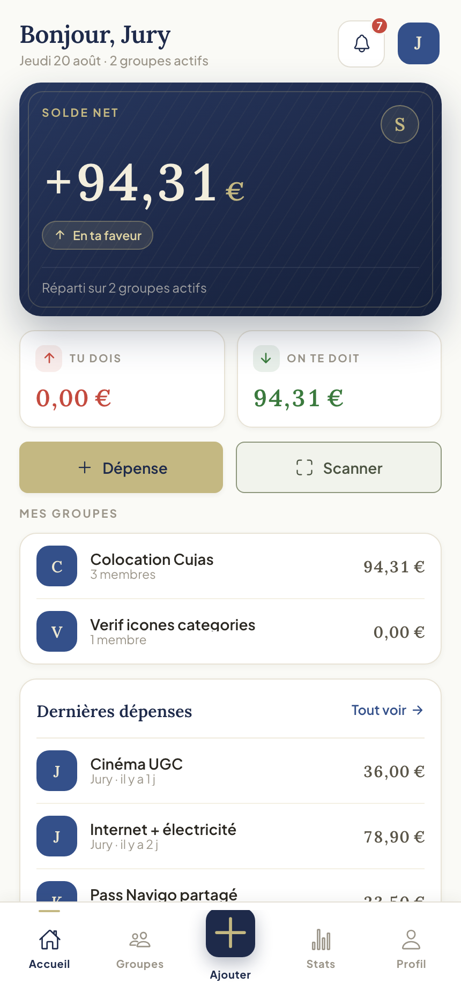

# split-easy-app

<p align="center">
  
</p>

<p align="center">
  
</p>

[](https://github.com/Saar45/split-easy-app/actions/workflows/ci.yml)

SPA Angular 20 + Ionic 8 de l'application **Split-Easy** (gestion de dépenses partagées entre groupes).
Projet fil rouge CDA niveau 6 (RNCP 37873), IPSSI promotion 2025-2026.

Backend Symfony : repo séparé `split-easy-api`.

## Démarrage rapide

### En local (hot reload)

```bash
git clone <repo-url> split-easy-app
cd split-easy-app
npm install --legacy-peer-deps
npm start          # ng serve sur http://localhost:8100
```

Pré-requis : l'API doit tourner en parallèle (cf. README du repo `split-easy-api`).

### Via Docker

Le `docker-compose.yml` vit dans `split-easy-api`. Cloner les deux repos côte à côte puis :

```bash
cd ../split-easy-api
docker compose --profile dev up -d --build
```

Le service front est déclaré dans ce compose (profil `dev`, exposé sur le port 8100).

## Stack technique

| Composant   | Choix                                              |
| ----------- | --------------------------------------------------- |
| Framework   | Angular 20 (TypeScript strict)                     |
| UI mobile   | Ionic 8                                            |
| Navigation  | Bottom tab bar mobile, rail de navigation desktop (> 992px) |
| State/async | RxJS                                               |
| HTTP        | Angular HttpClient + Interceptors                  |
| Graphiques  | Chart.js                                           |
| Tests       | Karma + Jasmine (127 specs)                        |
| Conteneur   | Multi-stage node:20 → nginx:alpine                 |

## Structure du projet

```
split-easy-app/
├── src/
│   ├── app/
│   │   ├── core/                 # services, guards, interceptors, models
│   │   ├── shared/                # composants et pipes réutilisables
│   │   ├── features/              # modules lazy-loadés : auth, dashboard, groupes
│   │   │                          # (detail, balances, create), depenses (add, detail),
│   │   │                          # remboursements, invitations, statistiques,
│   │   │                          # notifications, profil
│   │   ├── tabs/                  # bottom tab bar (5 entrées) / rail desktop
│   │   ├── app.module.ts
│   │   └── app-routing.module.ts
│   ├── assets/logo/                # logo, favicons, monogramme
│   ├── environments/              # environment.ts / environment.prod.ts
│   ├── theme/variables.scss       # tokens charte graphique
│   └── global.scss                # Google Fonts + Ionic CSS
├── docs/
│   ├── features/                  # documentation par fonctionnalité
│   └── screenshots/                # captures d'écran pour le rendu jury
├── Dockerfile                    # build multi-stage node → nginx
├── nginx.conf                    # SPA fallback + headers sécurité
└── .dockerignore
```

## Tests

```bash
npm test                            # Karma watch
npx ng test --watch=false --browsers=ChromeHeadless --code-coverage
```

127 specs Karma/Jasmine (services, composants critiques, pipes).

## Fonctionnalités livrées

| Code | Périmètre |
|------|-----------|
| F1   | Auth : login, register, refresh, JWT en RAM |
| F2   | Liste / création / détail groupes + invitations |
| F3   | Ajout, modification et suppression de dépense (règle des 24h) avec scan OCR de ticket (préremplissage montant / date / commerçant) |
| F4   | Répartition 3 modes (chips équitable / personnalisée / pourcentage) |
| F5   | Vue Soldes dédiée avec plan de remboursement optimisé, comparaison avant/après |
| F6   | Workflow remboursement bipartite (proposer / accepter / contester / annuler) |
| F7   | Page Invitations en attente |
| F8   | Statistiques avec doughnut et line charts (Chart.js) |
| F9   | Cloche notifications dans l'Accueil + page Notifications avec polling 30s |
| RGPD | Consentement CGU horodaté à l'inscription, export données et suppression compte depuis Profil |
| UI   | Refonte visuelle v1.2.0 (12 écrans) sur la base de la charte graphique et des tokens CSS |

## Comptes de test

Mêmes comptes que le backend (voir README du repo `split-easy-api`).

## Documentation et suivi

- Dossier de projet v5.0 : remis hors repo (PDF Teams jury).
- Documentation par feature (F1 à F9) : voir [`docs/features/` dans split-easy-api](https://github.com/Saar45/split-easy-api/tree/main/docs/features) et [`docs/features/` ici](docs/features/).
- Suivi opérationnel : [GitHub Issues](https://github.com/Saar45/split-easy-app/issues) et [Pull Requests](https://github.com/Saar45/split-easy-app/pulls).
- Backend Symfony : [`Saar45/split-easy-api`](https://github.com/Saar45/split-easy-api).

## Statut

Tag de livraison courant : [`v1.2.1`](https://github.com/Saar45/split-easy-app/releases/tag/v1.2.1). Feature-complete et conforme au dossier de projet v5.0.

Historique : tag de livraison Jalon 5 : [`v1.0.0`](https://github.com/Saar45/split-easy-app/releases/tag/v1.0.0).
